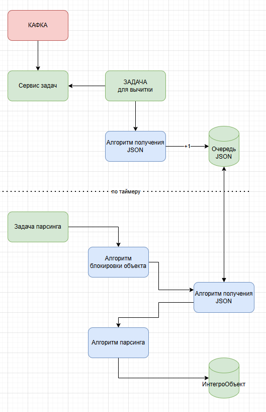

Паттерны
!!! Правило номер 1 , контролировать типы данных в объектной модели, и JSON схеме
!!! Правило номер 2, проконтролировать типы данных в объектной модели и условиях запроса
!!! Правило 3, для типа данных timestamp, Платформа упадет в ошибку если увидит микросекунд
!!! Десериализация для интегро объекта через AI
!!! Паттерн. Если где-то в алгоритме вы добавили счетчик и вы далее по логике есть условие разделяющее логику, то скорее всего на каждой ветке вытекающего из условия надо будет добавить увеличение этого счетчика

Вводные:
Значение 
## - топик	mes.acs-2-mes.transformed.okatyshi-sampler-tests-cpo.ver1
## - in_FLOWNAME	EXCH_310_OKATYSHI_SAMPLER_TESTS
## - EXCH_FLOWTEXT	  Результаты испытаний окатышей с Пробоотборника 
## - Интегро объект	EXCH_310_OKATYSHI_SAMPLER_TESTS
## - Имя таблицы  exch_310_okatyshi_sampler
## - Задача выборки	EXCH_310_OKATYSHI_SAMPLER_TESTS
## - Задача RUN	EXCH_310_RUN_OKATYSHI_SAMPLER_TESTS
## - Задача TO BP	EXCH_310_OKATYSHI_SAMPLER_TESTS_TO_BP
    - периодичность: /30 * * * ?
## - Запрос  EXCH_310_OKATYSHI_SAMPLER_TESTS
## - Запрос  EXCH_310_OKATYSHI_SAMPLER_TESTS_TO_BP
## - Алгоритм парсинга	EXCH_310_OKATYSHI_SAMPLER_TESTS
## - Алгоритм перекладывания в бизнес  EXCH_310_OKATYSHI_SAMPLER_TESTS_TO_BP


# План работ
## 0.   Создание источника данных
## 1.	Создание задачи для выборки данных  - ok
добавить алгоритм EXCH_COMMON_LOADER
## 2.	Создание нового FLOW_REF - ok
## 3.	Создание JSON схемы - ok
В идеале просто выбираем топик из списка и структура сама подтягивается.
Затем просто перепроверяем типы данных
## 4.	Создание интегро объекта  - ok
Делаем таблицу маппинга JSON и атрибутов в объекте
## 5.	Создание запроса для выборки «сырых» сообщений   - ok
- нужно сначала определиться с бизнес ключом (как мы будем отбирать уникальные сообщения)
бизнес-ключ - комбинацию полей:  номер пробы - AnalyizerId, номер свойства (испытания) - TestItemId.
EXCH_310_OKATYSHI_SAMPLER_TESTS_1.deleted=false and
EXCH_310_OKATYSHI_SAMPLER_TESTS_1.exch_messages_id = :MessageId and 
EXCH_310_OKATYSHI_SAMPLER_TESTS_1.EXCH_ANALYZER_ID = :AnalyizerId and
EXCH_310_OKATYSHI_SAMPLER_TESTS_1.EXCH_TEST_ITEM_ID = :TestItemId

## 6.	Создание алгоритма парсинга - ok
Скопировал имеющийся от 301 потока.
Надо заменить: 
-	ссылку на схему, 
-	ссылку на Объект, 
-	ссылку на запрос
-	в блоке логирования указать новое имя потока
-	в блоке запроса указать вычисление для нового параметра
-	в блоке для получения ИД экземпляра указать новое имя (вызывает сложность всегда)
-	маппинг данных выполнить
## 7.	Создание задачи для париснга - ok
ввести : CRON, 0 * * * *
добавить алгоритм - EXCH_COMMON_STARTER
FLOWNAME: EXCH_310_OKATYSHI_SAMPLER_TESTS
## 8.	Добавление алгоритма парсинга в STARTER_LOCAL - ok
## 9.	UNIT-TEST парсинга
- проверить что задача в расписании
- сделать тестовое сообщения номер=1
- Отправить сообщение из КАФКА
- Проверить что данные легли в очередь для обработки
- Выполнить задачу для парсинга
- Проверить что данные распарсились
  - ОШИБКА данные не парсятся/ Скорее всего в объекте EXCH_COMMON_LOCKS стоит еще STARTED
## 10.	Создание запроса для выборки необработанных интегро экземпляров - ok
просто берем все атрибуты из интегро объекта
и только в условиях добавляем что надо брать все 
....deleted = false and 
....exch_datetime_process IS NULL
без параметров
## 11.	Создание алгоритма для перекладывания в бизнес-слой
Копируем 301 алго
 меняем в нем:
  в переменной связку с новым запросом
  в переменую с новым объектом
  в блоке с установкой блокировки потока меняем наименование потока
  в блоке с началом логирования потока меняем наименование потока
  в блоке с окончанием логирования потока меняем наименование потока
  в блоке со снятием блокировки потока меняем наименование потока
  в блоке для загрузки объекта, меняем наименование объекта
  в блоке вычисление перевыбрать переменную для установку DATETIME_PROCESS 
## 12.	Создание задачи для перекладывания в бизнес-слой
- пока у нас заглушка, мы просто делаем задачу но не добавляем в расписание
## 13.	UNIT-TEST перекладывания в бизнес-слой


``` JSON
{
  "MessageId": 1,
  "MessageTypeName": "Сообщения об испытаниях окатышей",
  "MessageTypeId": 700000,
  "AggregateId": 15000,
  "MessageTimeStamp": "2026-03-19T05:24:51Z",
  "SampleTime": "2026-03-19T05:24:51Z",
  "TestTime": "2026-03-19T05:24:51Z",
  "AnalyizerId": 105,
  "SampleName": "Объединенная",
  "sampleTypeDescr": 11,
  "ozm": "2387941",
  "refLocalMaterialsNumId": 20201,
  "materialName": "Офлюсованный окатыш ЦПО",
  "selectionPointDescr": "Участок обжига",
  "selectionPointNumId": 10019,
  "startDate": "2026-01-26T05:24:51Z",
  "stopDate": "2026-01-26T05:24:51Z",
  "SampleResults": [
    {
      "TestItemId": 4592,
      "TestItemName": "Фракция <5мм",
      "DataFrequency": "hour",
      "TestValue": 35.1
    }
  ]
}
```

