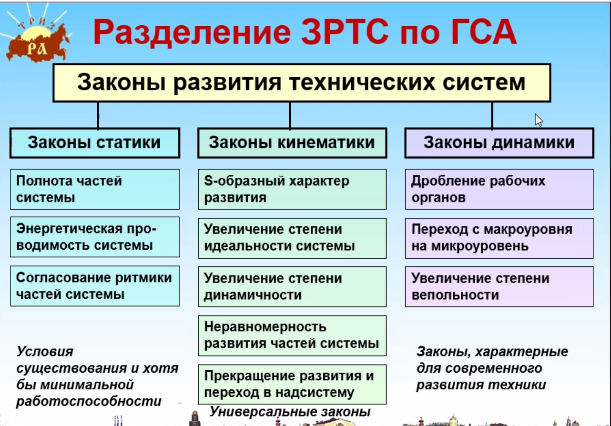
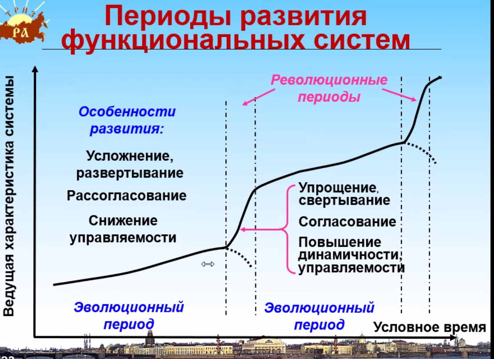
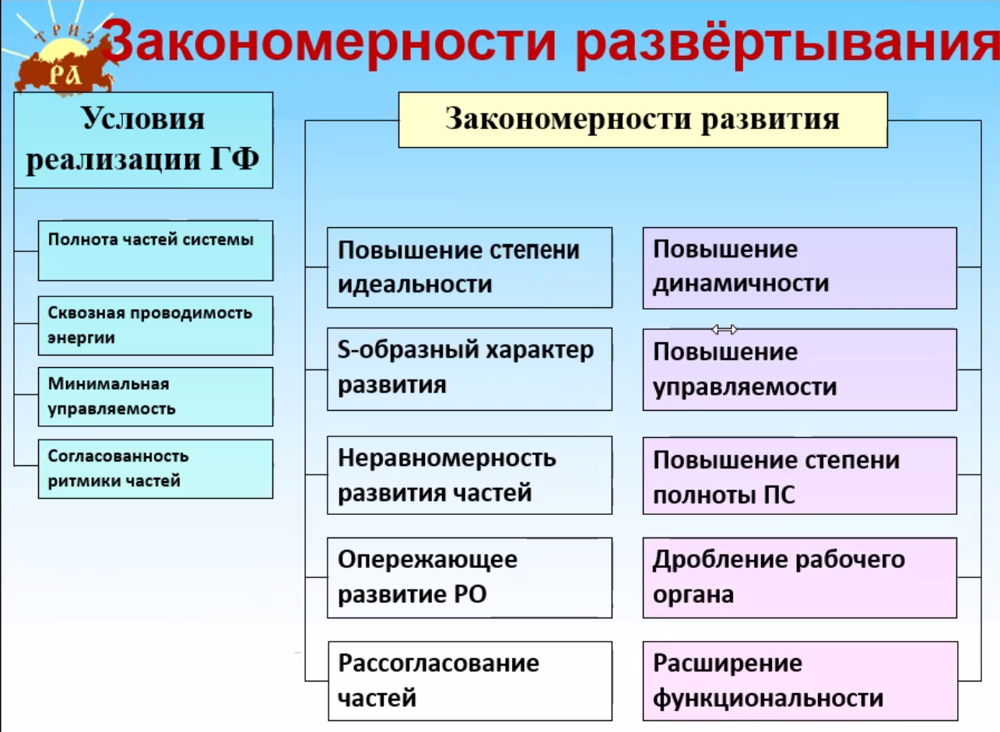

Смотри, ТРИЗ в этом уроке говорит про очень простую вещь: **любая система (будь то чайник, автомобиль, твой код или даже ты сам) живет по определенным правилам.** Это как законы природы, 
только для технологий.

Давай разберем это на пальцах.

---

### 🌱 1. Как рождается и живет система (S-кривая)

Представь жизнь любого продукта как жизнь человека:

1.  **Младенчество (Зарождение):** 🍼
    *   Система только появилась. Она неуклюжая, дорогая, постоянно ломается.
    *   *Пример:* Первые автомобили были как «ведра с болтами» — едут, но страшно.
    *   *Главная задача:* Просто выжить и доказать, что это вообще работает.

2.  **Юность и расцвет (Бурный рост):** 🚀
    *   Всё полетело! Систему улучшают, она становится мощнее, дешевле, круче.
    *   *Пример:* Автомобили 20 века — появлялись новые модели каждый год, скорости росли.
    *   *Главная задача:* Выжать максимум из идеи.

3.  **Зрелость (Стабилизация):** 😐
    *   Улучшать уже почти нечего. Добавляют «финтифлюшки» (подогрев сидений, цвет корпуса), но суть не меняется.
    *   *Пример:* Современный автомобиль с ДВС. Ну не сделаешь ты двигатель в 10 раз мощнее при том же расходе. Уперлись в потолок.
    *   *Главная задача:* Держать марку, пока не придёт кто-то новый.

4.  **Старость или переход (Угасание):** 👋
    *   Система либо умирает, либо становится частью чего-то большего.
    *   *Пример:* ДВС уступает место электрокарам. Кнопки в телефоне исчезли, став частью экрана.

> **Фишка:** Если ты видишь, что система в «зрелости» — не трать силы на её бесконечное улучшение. Ищи новую идею (новую кривую).

---

## 🟢 Группа 1: Законы СТАТИКИ
*(Условия минимальной работоспособности)*

Это «базовый набор». Если система не проходит эти законы — она **мертворожденная**. Просто не взлетит.

### 🔹 Закон полноты частей системы
> **Суть:** Чтобы система работала, у неё должны быть ВСЕ 5 органов:
> - Двигатель (кто даёт силу)
> - Трансмиссия (кто передаёт)
> - Рабочий орган (кто делает дело)
> - Управление (кто решает)
> - Источник энергии (откуда всё берётся)

**По-простому:** Нельзя собрать машину из руля и колёс и ожидать, что она поедет. Нужен ещё мотор, бензин и водитель.

**Пример из жизни:**
*   Твоя Lowcode-платформа: есть редактор (РО), есть сервер (двигатель), есть БД (память), есть ты (управление), есть электричество (источник). Всё на месте? Работает! ✅
*   А если сервер есть, а розетки нет — система «статически неполная». ❌

---

### 🔹 Закон энергетической проводимости системы
> **Суть:** Энергия должна свободно проходить через ВСЕ части системы, без «пробок» и потерь.

**По-простому:** Представь шланг с водой. Если он пережат — вода не дойдёт до грядки, хоть насос и мощный.

**Пример из жизни:**
*   В коде: если у тебя мощный бэкенд, но «узкое горлышко» в сети или базе данных — система тормозит. Энергия (запрос) не доходит до рабочего органа.
*   В команде: если ты (источник идеи) классно придумал, но не донёс до разработчика (трансмиссия) — результат будет так себе.

---

### 🔹 Закон согласования ритмики частей системы
> **Суть:** Все части системы должны работать в одном темпе, не мешая друг другу.

**По-простому:** Бесполезно ставить двигатель от Формулы-1 на телегу — она просто развалится на первом повороте. Или когда один в команде работает спринтом, а другой — вальяжно, как на прогулке.

**Пример из жизни:**
*   Фронтенд отрисовал интерфейс за 1 секунду, а бэкенд думает 10 секунд — пользователь видит «крутилку» и бесится. Ритм не согласован.
*   Ты пишешь ТЗ быстро, а команда внедряет медленно — возникает «затор» и раздражение.

> 💡 **Когда смотреть на СТАТИКУ:** Когда система **только создаётся** или **внезапно перестала работать**. Спроси: «Все ли части на месте? Не пережат ли «шланг»? Не рассинхронизировались ли мы?»

---

## 🟡 Группа 2: Законы КИНЕМАТИКИ
*(Универсальные законы развития — как система растёт)*

Система выжила? Отлично. Теперь она хочет расти. Эти законы описывают, **как** она это делает.

### 🔹 Закон неравномерности развития частей системы
> **Суть:** Разные части системы развиваются с разной скоростью. Всегда.

**По-простому:** В телефоне процессор каждые 2 года мощнее в 2 раза, а батарея — почти не меняется. Вот и ждём зарядку часами.

**Пример из жизни:**
*   В твоей платформе: визуальный редактор улетел вперёд, а генератор кода — отстаёт. Получается «красивая обёртка» с «медленной начинкой».
*   В команде: один спец стал гуру, другие — ещё нет. Возникает дисбаланс.

> **Что делать:** Ищи «отстающее звено» и подтягивай его. Или меняй систему так, чтобы это звено больше не было критичным.

---

### 🔹 Закон перехода в надсистему
> **Суть:** Когда система исчерпала возможности роста, она становится частью чего-то большего.

**По-простому:** Кнопка на телефоне умерла, став частью сенсорного экрана. Отдельная видеокарта умерла, став частью процессора.

**Пример из жизни:**
*   Твой справочник был отдельной программой → стал модулем в MES → стал частью единой цифровой платформы.
*   Ты был просто аналитиком → стал «фуллстеком» → стал частью архитектурного комитета.

> **Фишка:** Это не смерть, это **апгрейд через растворение**. Система исчезает как отдельная штука, но её функция живёт в чём-то большем.

---

### 🔹 Закон увеличения степени идеальности системы
> **Суть:** Система стремится к идеалу, где **функция растёт, а затраты падают**.

**По-простому:** Идеал — это когда **системы нет, а функция есть**.

**Пример из жизни:**
*   Лучшая камера — это не та, что снимает, а та, которой нет, но фото получаются (нейросеть).
*   Лучшая защита от дурака — не инструкция, а интерфейс, в котором нельзя ошибиться.
*   Лучший код — тот, который не надо писать (сгенерировался сам из требований).

> **Вопрос себе:** «Как сделать так, чтобы моя система делала БОЛЬШЕ, а требовала МЕНЬШЕ?»

---

### 🔹 Закон увеличения степени динамичности и управляемости
> **Суть:** Система эволюционирует от жёсткой → к гибкой → к адаптивной.

**По-простому:**
*   Жёсткая: молоток (одна форма, одна функция)
*   Гибкая: разводной ключ (можно подстроить)
*   Адаптивная: умный гайковёрт (сам понимает, какую гайку крутит)

**Пример из жизни:**
*   Твоя платформа: сначала жёсткие шаблоны → потом настраиваемые блоки → потом AI, который сам предлагает решения.
*   В команде: сначала жёсткие роли → потом кросс-функциональность → потом самоорганизация.

---

### 🔹 Закон перехода с макроуровня на микроуровень
> **Суть:** Система переходит от работы с «большим» к работе с «малым» — полями, информацией, микрочастицами.

**По-простому:** Вместо того чтобы толкать ящик руками (макро), мы используем электрический сигнал (микро), который управляет мотором.

**Пример из жизни:**
*   Вычисления: комната с лампами → транзистор → микрочип → квантовый бит.
*   Управление: рычаги → кнопки → сенсор → голос → мысль (интерфейсы мозг-компьютер).
*   В разработке: ручное написание кода → визуальное моделирование → генерация из текста (AI).

---

### 🔹 Закон S-образного развития
> **Суть:** Любая система развивается по кривой: медленно → быстро → медленно → новая кривая.

**По-простому:** Ты учишь новый язык: сначала тяжело и медленно, потом — прорыв и быстро, потом — плато «вроде всё знаю, но не идеально». Чтобы расти дальше — нужно сменить метод (новая кривая).

**Пример из жизни:**
*   Твоя экспертиза в Lowcode: сначала разбирался по крупицам → потом быстро рос → сейчас, возможно, плато. Следующая кривая — не «ещё больше знать платформу», а «научиться создавать платформы».

> **Главный вывод:** Если упираешься в потолок на одной кривой — не долби стену, а ищи дверь в новую.

---

## 🔴 Группа 3: Законы ДИНАМИКИ
*(Законы современного развития — куда всё катится прямо сейчас)*

Это «продвинутый уровень». Система уже большая, умная — что дальше?

### 🔹 Закон вытеснения человека из технической системы
> **Суть:** Система стремится взять на себя функции, которые раньше делал человек.

**По-простому:** Раньше ты сам считал в уме → потом калькулятор → потом эксель сам подтянул формулы → теперь AI сам предлагает решение.

**Пример из жизни:**
*   Тестирование: раньше ты вручную проверял → потом автотесты → теперь AI сам генерирует тест-кейсы.
*   Сбор требований: ты интервьюируешь → потом аналитика логов → потом AI сам выявляет потребности из поведения пользователей.

> **Вопрос себе:** «Какую свою рутинную функцию я могу «отдать» системе уже сейчас?»

---

### 🔹 Закон дробления рабочих органов
> **Суть:** Рабочий орган стремится разделиться на независимые части, которые работают гибче.

**По-простому:** Вместо одного большого ножа — мультирезка с насадками. Вместо монолита — микросервисы.

**Пример из жизни:**
*   Твой рабочий орган (аналитика): раньше ты один делал всё → теперь ты делегируешь части команды или автоматизируешь модулями.
*   В платформе: вместо одного редактора — отдельные модули для данных, логики, интерфейса.

---

### 🔹 Закон увеличения степени вепольности
*(Веполь = Вещество + Поле)*
> **Суть:** Система становится эффективнее, когда добавляет «третье» — поле, вещество, информацию — для усиления взаимодействия.

**По-простому:**
*   Было: магнит притягивает железо (вещество + вещество).
*   Стало: магнит + электрический ток (поле) = электромагнит, которым можно управлять.

**Пример из жизни:**
*   Твоя платформа: было «код + данные» → стало «код + данные + метрики» → стало «код + данные + AI-рекомендации».
*   В команде: было «ты + задача» → стало «ты + задача + чат-бот с подсказками».

> **Фишка:** Ищи, какое «третье» (поле, данные, алгоритм) можно добавить, чтобы усилить систему без её переделки.

---

## 🧭 Шпаргалка: какой закон когда вспоминать?

| Ситуация | Смотри закон... | Вопрос себе |
|----------|----------------|-------------|
| **Система не работает с самого начала** | СТАТИКА (полнота, энергия, ритм) | «Все ли части на месте? Не «пережат» ли поток?» |
| **Система работает, но растёт криво** | КИНЕМАТИКА (неравномерность) | «Какое звено отстаёт? Что тянет назад?» |
| **Система уперлась в потолок** | КИНЕМАТИКА (переход в надсистему, идеальность) | «Можно ли растворить систему в чём-то большем? Как сделать функцию без системы?» |
| **Система стала неповоротливой** | КИНЕМАТИКА (динамичность) | «Как сделать её гибче? Адаптивнее?» |
| **Система стала слишком большой/сложной** | ДИНАМИКА (дробление, макро→микро) | «Можно ли разбить на части? Перейти на уровень информации/поля?» |
| **Хочешь «убить» рутину** | ДИНАМИКА (вытеснение человека) | «Что из моей работы может делать система сама?» |
| **Хочешь усилить без переделки** | ДИНАМИКА (вепольность) | «Какое «третье» (данные, алгоритм, поле) можно добавить?» |

---

### 🔄 3. Куда всё движется? (Тренды)

Если смотришь на систему и думаешь «что с ней будет дальше?», смотри на эти тренды:

*   **Всё становится гибким.** 🤸
    *   Было жёсткое → стало гнуться → стало адаптивным.
    *   *Пример:* Антенна: провод → телескопическая → скрытая в корпусе → программная (в чипе).
*   **Всё уменьшается.** 🔬
    *   Было большое и механическое → стало маленьким и на полях/информации.
    *   *Пример:* Вычисления: комната с лампами → транзистор → микрочип.
*   **Всё стремится к идеалу.** ✨
    *   Идеал — это когда **системы нет, а функция есть**.
    *   *Пример:* Лучшая камера — это не та, что снимает, а та, которой нет, но фото получаются (нейросеть генерирует).

---

### 🧭 Как этим пользоваться в жизни?

Когда у тебя есть задача (улучшить фичу, выбрать инструмент, спланировать развитие), просто спроси себя:

1.  **А она вообще живая?** (Есть ли все 5 частей? )
2.  **Где она на кривой?** (Мы её только придумали или уже выжали всё, что можно?)
3.  **Что ей мешает стать идеальной?** (Она слишком большая? Слишком тупая? Слишком зависимая?)
4.  **Куда дует ветер?** (Может, это вообще скоро заменит нейросеть и не стоит заморачиваться?)

---

### 🎯 Пример на твоем проекте (Lowcode)

Давай прикинем, где твоя платформа:

*   **Статика:** Все части есть? (Редактор, движок, БД, деплой). Если да — живая.
*   **S-кривая:** Скорее всего, этап **бурного роста** или входа в зрелость. Функционал растёт, но сложность тоже.
*   **Тренды:**
    *   *Динамичность:* Можно ли легко менять логику без переписывания? Если да — круто.
    *   *Макро→Микро:* Вы ещё «кликами» собираете или уже можно логикой/скриптами управлять?
    *   *Идеальность:* А можно ли вообще без платформы? Чтобы требования сами превращались в код (AI)? 👈 Вот это, скорее всего, и есть «следующая кривая».

---

### 💬 Короче, суть урока:

> **Не воюй с законами, а используй их.**
> Если система упирается в потолок — не долби её, а ищи новый принцип.
> Если чего-то не работает — проверь, не отвалилась ли «энергия» или «ритм».

Алгоритм построения Системной Горизонтали (7 шагов)
1. выбрали объект
2. сформулировать главную функцию (знаем на что направлено изделие)
3. необходима информация о различных состояних объета, расскладываем в исторической связи развитие этого объекта. 
4. связываем шаги развития слева на право (важна последовательность развития)
5. определяем ПОЧЕМУ произошел переход с этапа на этап, при этом глядя на след этап, выделяем ведущий недостаток (наиболее сущственный)
6. проследить недостатки до сегодняшнего дня
7. выделить какие недостатки есть сегодня

ДЗ 
1. построить системную горизонталь - обычной авторучки (окрашивать бумагу) . 
2. написать закономерности развития для каждого этапа построенных ранее системных горизонталей
    - для ручки одну две. попытаться уловитель долгосрочную тенденцию
    - еще и для других горизонталей

требований к формату предоставления нет, достаточно рассказать

_____
Системная горизонталь для ручки:
1. Тростниковое/костяное писало -
Твёрдый стержень, обмакиваемый в глину/воск или ранние чернила
*   недостаток: Грубый штрих, хрупкость, невозможность тонкой детализации
*   Что устранил следующий: Гибкость пера, контроль нажима, плавная линия

2. Гусиное перо -
Cтержень с расщеплённым кончиком, макание в чернильницу
*   недостаток : Быстрый износ, необходимость частой заточки, нестабильность качества
*   что устранил следующий: Долговечность, стандартизация, массовое производство

3. Металлическое перо + держатель  -
Штампованное стальное/золотое перо на сменной рукоятке
*   недостаток : Постоянное макание, риск проливов, низкая автономность, неудобство в пути
*   что устранил следующий: Встроенная подача чернил, автономность, защита от протечек

4. Перьевая ручка  -
Встроенный резервуар
*   недостаток : Протечки при перепадах давления/температуры, размазывание, чувствительность к углу, требовательность к обслуживанию
*   что устранил следующий: Вязкие чернила + шарик = надёжность, письмо в любом положении, минимальный уход

5. Шариковая ручка  Ласло Биро-
Вращающийся шарик + маслянистые чернила в герметичном стержне
*   недостаток : Тугое письмо, пропуски, необходимость давления, блёклые линии, быстрое затупление шарика
*   что устранил следующий: Низкое трение, яркий насыщенный штрих, плавный ход без нажима

6. Гелевая/капиллярная ручка
Водные/полимерные чернила + микропористый или роликовый наконечник
*   недостаток : зависимость от бумаги, Усталость кисти, риск травм, ограниченность поверхностей, разрыв между аналогом и цифрой

---
Этапы развития

| Шаг | Применимая закономерность развития ТС | Как проявляется в ручке | Как проявляется в ручке |  |
|------|----------------------------------|----------------------------------------|--------------------------|---------------------------------------------------------------|
| **1. Тростниковое/костяное писало** | 🔹 **Закон полноты частей системы** 🔹 **Закон увеличения управляемости** | Инструмент минимально функционален: жёсткий, не адаптируется к нажиму, штрих грубый | Нужна тонкая детализация → возникает противоречие: *жесткость vs управляемость* |
| **2. Гусиное перо** | 🔹 **Закон динамизации** 🔹 **Закон согласования ритмики** | Перо изгибается под нажимом, ритм подачи чернил синхронизируется с движением руки | Быстрый износ, нестабильность → противоречие: *гибкость vs долговечность* |
| **3. Металлическое перо + держатель** |🔹 **Закон перехода к искусственным материалам** 🔹 **Закон стандартизации и свертывания** | Массовое производство, сменяемость, стабильное качество штриха | Постоянное макание, протечки → противоречие: *автономность vs простота конструкции* |
| **4. Перьевая ручка** | 🔹 **Закон повышения идеальности** 🔹 **Закон полноты и согласования подсистем** | Чернила интегрированы в инструмент, автономность, защита от высыхания | Чувствительность к давлению/температуре, обслуживание → противоречие: *надёжность vs сложность подачи* |
| **5. Шариковая ручка (Биро)** | 🔹 **Закон перехода на микроуровень** 🔹 **Закон использования веществ с заданными свойствами** | Шарик заменяет перо, вязкие чернила не вытекают, письмо в любом положении | Тугое письмо, пропуски, блёклость → противоречие: *надежность vs плавность/яркость* |
| **6. Гелевая/капиллярная ручка** | 🔹 **Закон согласования системы с человеком** 🔹 **Закон увеличения степени вепольности (поле+вещество)** | Низкое трение, яркий штрих, письмо без нажима, комфорт при длительном использовании | Зависимость от бумаги, усталость кисти, ограниченность поверхностей, разрыв с цифрой → противоречие: *аналоговая тактильность vs цифровая гибкость и экологичность* |

---
### 🧭 Сводка: какие системные закономерности управляют эволюцией ручки

| Закономерность | Проявление в истории ручки | Текущий статус (2026) |
|----------------|----------------------------|------------------------|
| **Повышение идеальности** | Интеграция чернил в корпус → автономность → снижение обслуживания | Достижена в гелевых/шариковых моделях; дальнейший рост через отказ от пластика и одноразовых картриджей |
| **Динамизация** | Жёсткий стержень → гибкое перо → вращающийся шарик → адаптивный грип | Переход к «умным» грипам с памятью формы и датчиками нажима |
| **Переход на микроуровень** | Перо (мм) → шарик (0.5–1.0 мм) → микропористый наконечник (μm) → нанопокрытия чернил | Развитие нано-чернил с управляемой адгезией к любым поверхностям |
| **Согласование ритмики** | Синхронизация подачи чернил с нажимом руки → эргономика → биомеханическая поддержка | Встроенные датчики усталости, виброкоррекция позы, адаптивная вязкость |
| **Переход в сверхсистему** | Ручка как автономный инструмент → гибридный узел (бумага + датчик + облако + ИИ) | Активная фаза: офлайн-распознавание, проекция подсказок, мгновенная конвертация в вектор/код |
